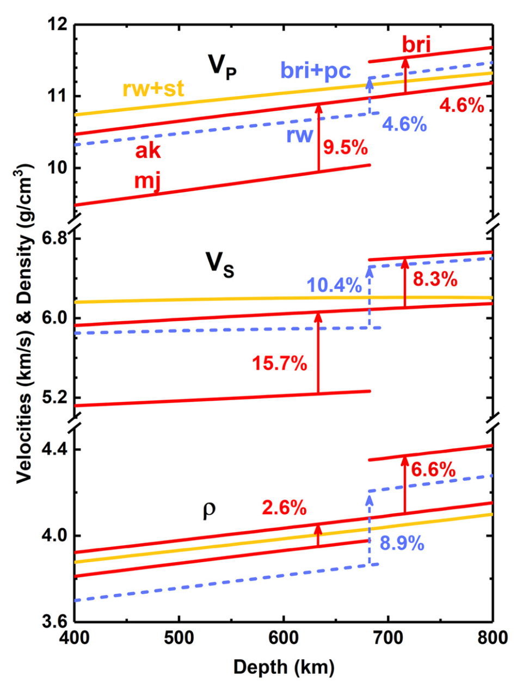
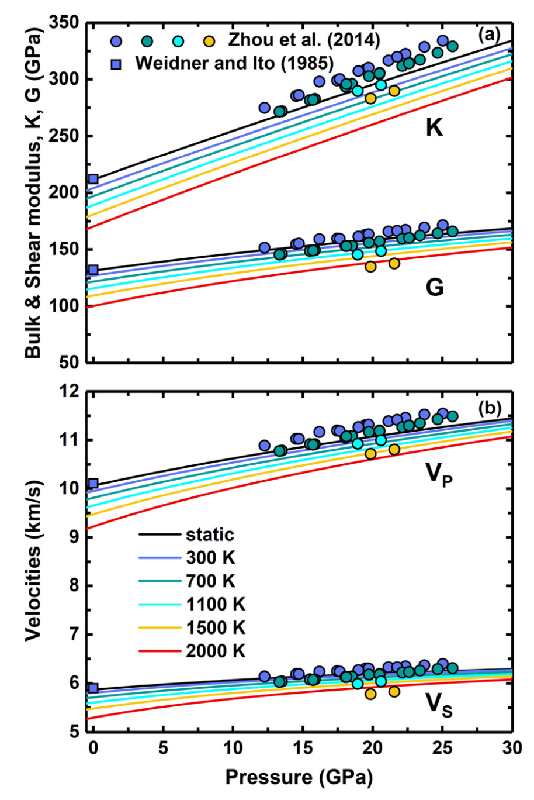

* Calculated the elasticity of akimotoite under the mantle conditions using first-principles calculations
* Estimated the *VP*, *VS*, and density contrasts caused by the akimotoite-related transitions
* Proved that the discontinuity at the depth of ~700-750 km in cold slabs could result from the decomposition of pyrope rather than the akimotoite-bridgmanite transition

Seismic studies have detected multiple discontinuities at the depth of ~600–750 km in some subduction zones and these complex discontinuities were ascribed to the phase transitions of non-olivine system such as the majorite-akimotoite-bridgmanite transitions at relatively low temperatures. However, the elasticity of akimotoite at the conditions of mantle transition zone is poorly constrained.
The equation of state and elastic properties of akimotoite at simultaneously high pressures and high temperatures are obtained using first-principles calculations based on the density functional theory. Combining our results with the elastic data of other minerals, we estimated the *VP*, *VS*, and density contrasts caused by the akimotoite-related transitions. The velocity contrasts between akimotoite and bridgmanite are 4.6% and 8.3% for *VP* and *VS*, respectively, which are only about half of those between majorite and akimotoite. Moreover, because both the akimotoite-bridgmanite and majorite-akimotoite transitions have broad phase boundaries, these two phase transitions may be not able to explain multiple discontinuities around ~660 km depth in subduction zones. Instead, the decomposition of pyrope into bridgmanite and corundum, which would occur in cold subduction zones with a sharp phase boundary and a large impedance contrast due to the inhibition of the pyroxene-garnet transformation at relatively low temperatures, could be a more reasonable explanation for the discontinuity at ~700–750 km in subduction zones. 
Furthermore, the transformation from high-pressure clinopyroxene to akimotoite at the depth of ~600 km can increase the *VP*, *VS*, and density by 10.1%, 14.8%, and 9.9%, respectively, indicating that the phase transition may account for the local discontinuity at ~600 km in some subduction zones. In addition, the anisotropies of akimotoite are significantly higher than those of other major minerals at the base of the mantle transition zone and could be the origin of the seismic anisotropies detected in some subduction zones.

**Fig. 1** Bulk modulus *K* and shear modulus *G*, (b) *VP* and *VS* of akimotoite at various temperatures and pressures. The solid lines are our calculation results, and the solid scatters represent experimental results (Weidner and Ito, 1985; Zhou et al., 2014).

**Fig. 2** *VP*, *VS*, and density contrasts caused by the majorite-akimotoite-bridgmanite (red solid lines and arrows) and post-spinel transitions (blue dashed lines and arrows) along the cold geotherm. The velocities and density of ringwoodite + stishovite are also shown for comparison.

This work was published in [Earth and Planetary Science Letters.](./2019EPSL_akimotoite.pdf)