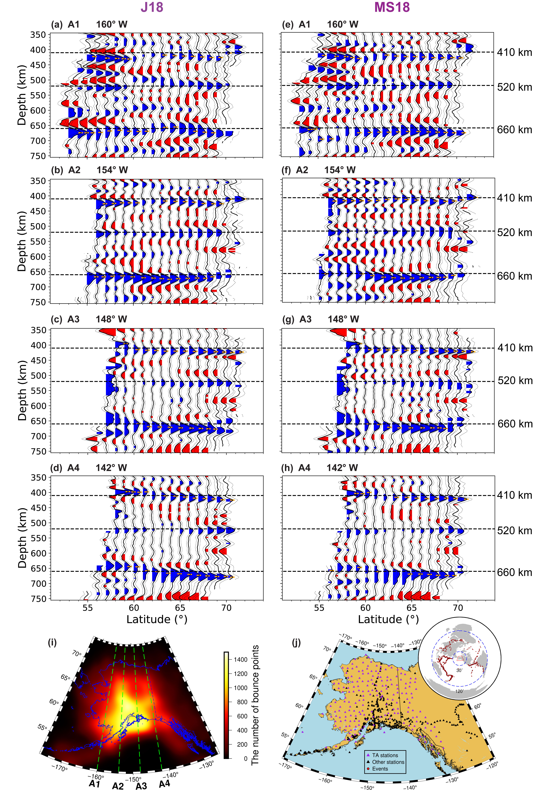
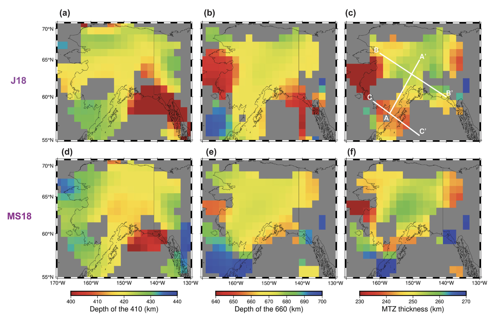

* Imaged the Moho and mantle transition zone (MTZ) discontinuities beneath Alaska by stacking long-period teleseismic SH waves
* Observed crustal thickness is generally consistent with surface topography and gravity measurements
* Suggested that the Pacific slab may have penetrated into the upper MTZ under central Alaska but not
under the Alaska Peninsula

Alaska is a tectonically active region with a long history of subduction and terrane accretion, but knowledge of its deep seismic structure is limited by a relatively sparse station distribution. By combining data from the EarthScope Transportable Array and other regional seismic networks, we obtain a high-resolution state-wide map of the Moho and upper-mantle discontinuities beneath Alaska using teleseismic SH-wave reverberations. Crustal thickness is generally correlated with elevation and the deepest Moho is in the region with basal accretion of the subducted Yakutat plate, consistent with its higher density due to a more mafic composition. The crustal thickness in the Brooks Range agrees with the prediction based on Airy isostasy and the weak free-air gravity anomaly, suggesting that this region probably does not have significant density anomalies. We also resolve the 410, 520, and 660 discontinuities in most regions, with a thickened mantle transition zone (MTZ) and a normal depth difference between the 520 and 660 discontinuities (d660-d520) under central Alaska, indicating the presence of the subducted Pacific slab in the upper MTZ. A near-normal MTZ and a significantly smaller d660-d520 are resolved under southeastern Alaska, suggesting potential mantle upwelling in the lower MTZ. Beneath the Alaska Peninsula, the thinned MTZ implies that the Pacific slab may not have reached the MTZ in this region, which is also consistent with recent tomography models. Overall, the results demonstrate a bent or segmented Pacific slab with varying depths under central Alaska and
the Alaska Peninsula.

**Fig. 1** N-S cross-sections in the MTZ across Alaska as corrected for the J18 (a–d) and MS18 (e–h) 3D velocity models. The color and dashed lines in (a–h) are consistent with Figure 3 and the horizontal black dashed lines represent depths of 410, 520, and 660 km. The “410” and “660” picks are marked as orange bars and the corresponding topography variations are plotted in Figure 6. The locations of the cross-sections and the number of bounce points for each cell at 535-km depth are shown in (i). The distribution of stations and events is shown in (j).

**Fig. 2** Estimated “410” and “660” depths and the MTZ thickness corrected using the J18 (a–c) and MS18 (d–f) 3D velocity models. Only results with a peak amplitude of at least 1% of the direct S amplitude, at least twice as strong as the second-highest peak, and contributed by more than 100 bounce points are plotted. The locations of the cross sections in Figure S6 in Supporting Information S1 are shown in (c).

This work was published in [JGR Solid Earth.](./2023JGR_Alaska.pdf)