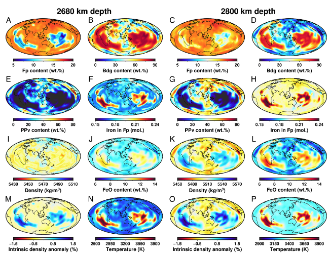

* Inverted for the 3D chemical composition and thermal state of the lower mantle based on seismic
tomography and mineral elasticity data
* Found that velocity heterogeneities in the upper lower mantle mainly result from thermal anomalies,
  whereas those in the lowermost mantle mainly result from compositional or phase variations
* Found that LLSVPs have ~500 K higher temperature, higher bridgmanite and iron content than the ambient mantle,
  supporting the origin from an ancient basal magma ocean

The compositional and thermal state of Earth’s mantle provides critical constraints on the origin, evolution, and dynamics of Earth. However, the chemical composition and thermal structure of the lower mantle are still poorly understood. Particularly, the nature and origin of the two large low-shear-velocity provinces (LLSVPs) in the lowermost mantle observed from seismological studies are still debated. In this study, we inverted for the 3D chemical composition and thermal state of the lower mantle based on seismic tomography and mineral elasticity data by employing a Markov chain Monte Carlo framework. The results show a silica-enriched lower mantle with a Mg/Si ratio less than ~1.16, lower than that of the pyrolitic upper mantle (Mg/Si = 1.3). The lateral temperature distributions can be described by a Gaussian distribution with a standard deviation (SD) of 120 to 140 K at 800 to 1,600 km and the SD increases to 250 K at 2,200 km depth. However, the lateral distribution in the lowermost mantle does not follow the Gaussian distribution. We found that the velocity heterogeneities in the upper lower mantle mainly result from thermal anomalies, while those in the lowermost mantle mainly result from compositional or phase variations. The LLSVPs have higher density at the base and lower density above the depth of ~2,700 km than the ambient mantle, respectively. The LLSVPs are found to have ~500 K higher temperature, higher Bridgmanite and iron content than the ambient mantle, supporting the hypothesis that the LLSVPs may originate from an ancient basal magma ocean formed in Earth’s early history.

**Fig. 1** The compositional and temperature distributions of the resulting model in lowermost mantle (2,680 km and 2,800 km depth) in the inversion of model GLAD- M25. (M and O) The intrinsic density anomaly structure assuming the temperatures are equal to the average temperature at each depth.

This work was published in [PNAS.](./2023PNAS_3d_inversion.pdf)