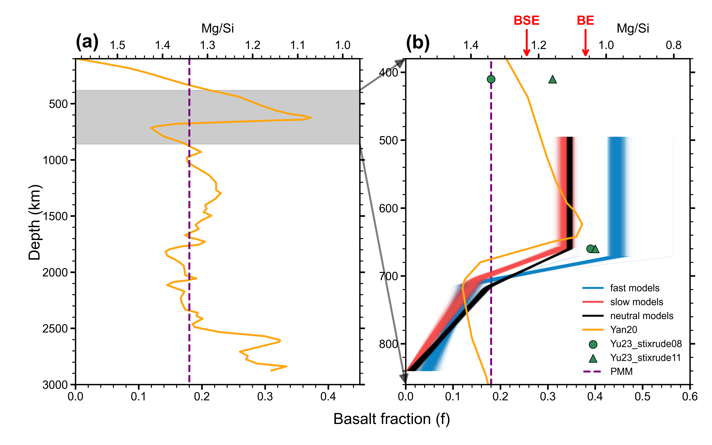
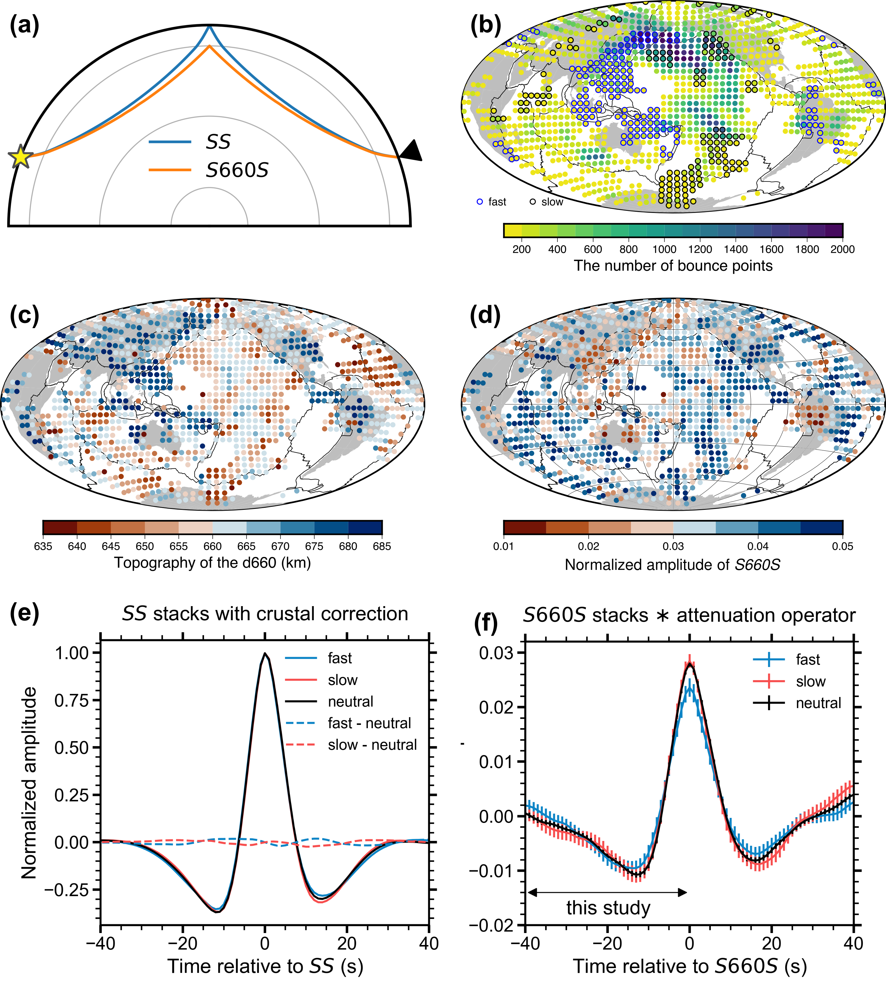
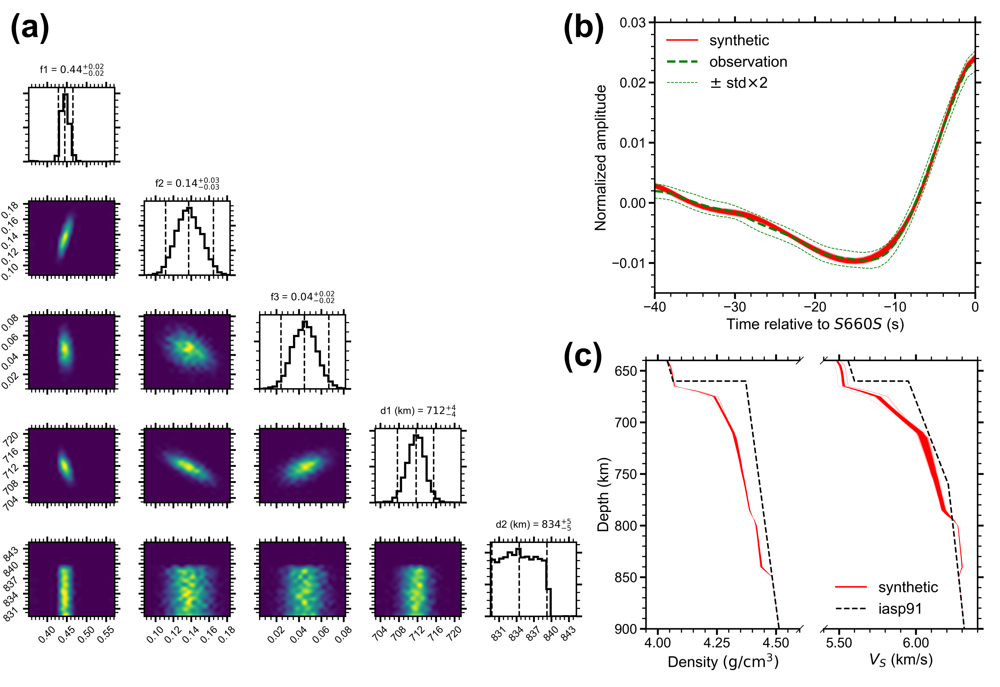

* Constrained seismic velocity, density, and basalt content at and below the 660-km discontinuity (d660) by *S660S* waveform inversions
* Found that slabs exhibit a smaller impedance jump across the d660 but a steeper gradient below the d660 compared to other regions
* Suggested that basalt accumulates at the d660, especially in subduction zones, but decreases significantly below it, forming a harzburgite-enriched layer

Mid-ocean ridges generate basalt and harzburgite, which are introduced into the mantle through subduction as a mechanical mixture, contributing to both lateral and radial compositional heterogeneity. The possible accumulation of basalt in the mantle transition zone has been examined, but details of the mantle composition below the 660-km discontinuity (hereafter d660) remain poorly constrained. In this study, we utilize the subtle waveform details of *S660S*, the underside shear-wave reflection off the d660, to interpret the seismic velocity, density, and compositional structure near, and particularly below, the d660. We identify a significant difference in *S660S* waveform shape in subduction zones compared to other regions. The inversion results reveal globally enriched basalt at the d660, with a notably higher content in subduction zones, consistent with the smaller impedance jump and *S660S* peak amplitude. The basalt fraction decreases significantly to less than 10% near 800-km depth, forming a global harzburgite-enriched layer and resulting in a steep seismic velocity gradient just below the d660, in agreement with 1D global reference models. The striking compositional radial variations near the d660 verify geodynamic predictions and challenge the applicability of homogeneous radial compositional models in the mantle. These variations may also affect the viscosity profile and, consequently, the dynamics at the boundary between the upper and lower mantle.

**Fig. 1** (a) Ray paths of \textit{SS} and \textit{S660S} at a representative epicentral distance of 140$^\circ$, where the star and triangle represent the earthquake and station, respectively. (b) Distribution of fast, slow, and neutral caps containing more than 100 bounce points. The fast and slow caps are delineated with \change{black and red}{blue and black} edges, respectively. The plotting size of the caps is smaller than the real radius of 5$^\circ$ to avoid overlapping. (c) Topography of the d660 in caps with more than 100 bounce points. \add{(d) Normalized Amplitude of \textit{S660S} in caps with more than 100 bounce points.} The black lines in (b-d) represent the plate boundary. (e-f) Corrected \textit{SS} and \textit{S660S} stacks in fast, slow, and neutral groups. The \textit{SS} stacks are corrected for variations in crustal thickness and the \textit{S660S} stacks represent the convolution of the original \textit{S660S} stacks and an attenuation operator, accounting for the additional attenuation of \textit{SS} compared to \textit{S660S}. Two-standard error bars are shown \add{in (f)}, which are estimated using the bootstrapping approach \cite{efron1991statistical}.

**Fig. 2** (a) Corner plot of Bayesian samples. The dashed lines represent the 2.5%, 50%, and 97.5% quantiles, accompanied by corresponding values in subtitles. (b) Observed and synthetic \textit{S660S} stacks. The observation is shown as the average with two standard errors estimated by bootstrapping. The synthetics are generated from Bayesian samples. \change{(c-d)}{(c)} $V_S$ and density profiles based on the samples, in comparison with the IASP91 \add{model }\cite{kennett1991traveltimes}.\remove{and PREM models (Dziewonski \& Anderson, 1981).

**Fig. 3** (a) Radial variations of basalt fraction and Mg/Si ratio from geodynamic modeling of \citeA{yan2020evolution}. (b) A close-up radial variation of basalt content near the d660. The blue, red, and black lines are Bayesian inversion results for the three groups in this study. Results from \citeA{yan2020evolution} and \citeA{yu2023seismic} are plotted for comparison. There are two different mineral datasets \cite{stixrude2011thermodynamics, xu2008effect} used in \citeA{yu2023seismic}, labeled as stixrude08 and stixrude11. Typical composition of the bulk Earth (BE), bulk silicate Earth (BSE), and the pyrolitic mechanical mixture (PMM) are from Allegre et al. (1995) and annotated by red arrows and a dashed line}.

This work was published in [AGU Advances.](./2024AGUAdv_SSpre_global.pdf)