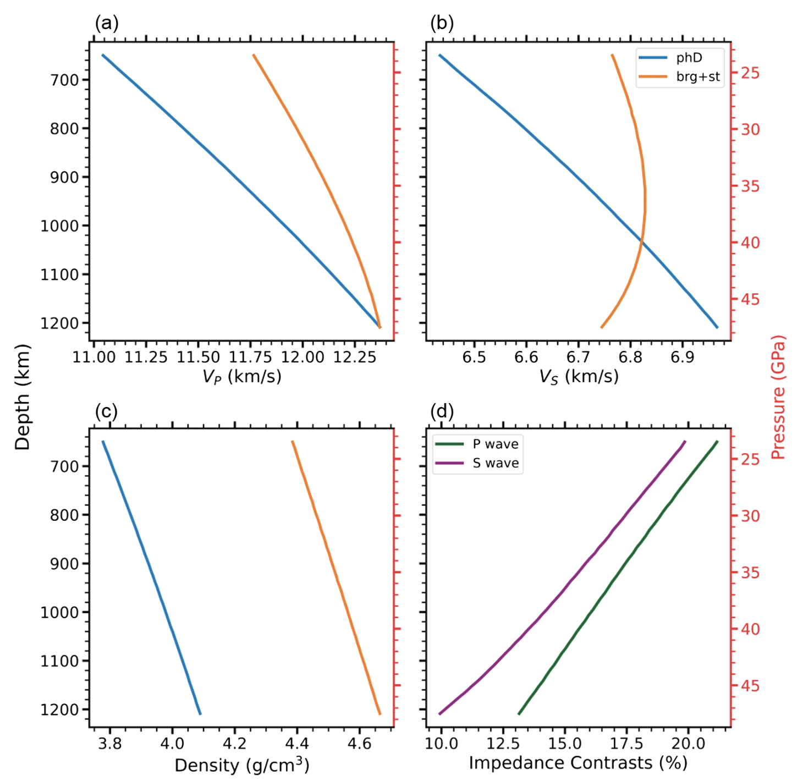

* Obtained elasticity and density of phase D under the lower-mantle conditions
* Proved that the accumulation of phase D may account for seismic anisotropy rather than low-velocity
anomalies in the uppermost lower mantle (ULM)
* Suggested that the decomposition of phase D in the ULM causes a density jump,
possibly explaining some discontinuities in subduction zones

The distribution of water reservoirs in the deep Earth is critical to understanding geochemical evolution and mantle dynamics. Phase D is a potential water carrier in the slab subducted to the uppermost lower mantle (ULM), and its seismic velocity and density characteristics are important for seismological detection in water reservoirs, but these properties remain poorly constrained. Here, we calculate the seismic velocities and density of Mg-end-member phase D (MgSi2H2O6) under the ULM conditions using first-principles calculations based on the density functional theory. The velocities of phase D are higher than those of periclase and slightly lower than those of bridgmanite by 0.5–3.4% for VP and by 0–1.9% for VS between 660 and 1000 km depths. Considering its relatively low content, phase D can hardly produce a low-velocity anomaly in the ULM observed by seismological studies. However, its strong elastic anisotropy may contribute significantly to the observed seismic anisotropy at a similar depth. Additionally, phase D dehydrates into bridgmanite and stishovite at the ULM, producing insignificant velocity changes but a substantial density increase of ~14%. Therefore, the dehydration is probably too weak to generate discontinuities associated with velocity jumps. In contrast, it may account for seismic discontinuities sensitive to impedance changes, particularly density jumps, near the dehydration depth observed in some subduction zones.

**Fig. 1** (a) Compressional wave velocity *VP*, ( b) shear wave velocity *VS*, and (c) densities of phase D (phD) and the aggregate of bridgmanite (brg) (Shukla et al. 2015) and stishovite (st) (Yang and Wu 2014) along the cold isotherm. (d) Impedance contrasts of P and S waves caused by the dehydration of phase D into bridgmanite and stishovite. (Color online.)

This work was published in [American Mineralogist.](./2025AM_phaseD.pdf)